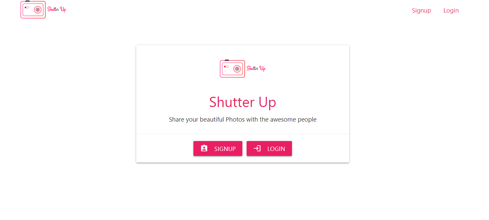

# Shutter-Up
This is a MERN stack application for sharing beautiful photos and chatting with your dear ones. In this application one user can follow other users, can like comment in other's post. It is something like Instagram.

___

### You can have a look at this website here [Shutter Up](https://shutter--up.herokuapp.com/)



___

## Project Specifications

* ### Technology Used
    * M - MongoDB, the database.
    * E - Express, the backend framework used to make the REST api.
    * R - React, the front end library, used to make the UI.
    * N - The backend JavaScript engine.
    * Materialize - The CSS framework for styling of components.

* ### Features
    * Acoount creation of New Users.
    * SignIn with authentication with jsonwebtoken.
    * Forgot Password feature via registered gmail id of user(If the gmail id actually exsists).
    * Customizing user account, change profile picture.
    * Search users with suggestion.
    * Follow, Unfollow users.
    * Creating New Post with photo.
    * Like, Comment in different posts.
    * Bookmark or Save some post for future reference.
    * Deleting your post.
    * View your followers post in different feed.
    * Shutter UP direct - a personal chatting feature with your frineds.

___

#### To run this project on your local machine you need to take the following steps

* Install node.js in your machine
* Open the cmd/powershell/bash in the root directory and run the following commands in order
    * ```bash
        npm install

        cd client

        npm install

        cd ..

        npm run dev

    ```


